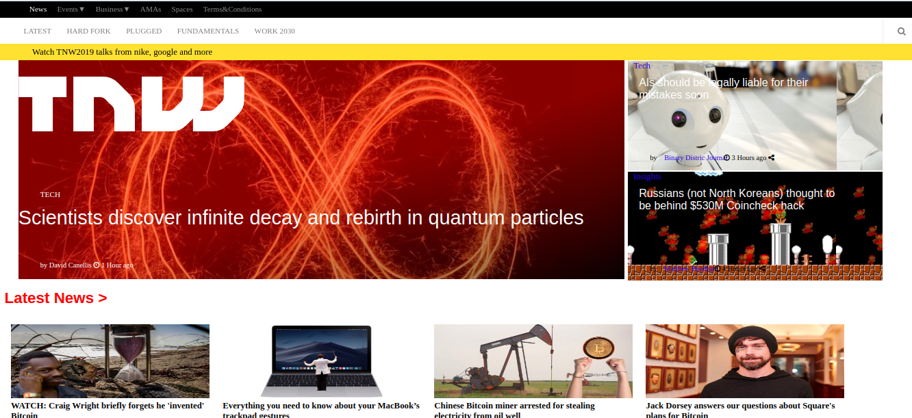

# Project: Responsive WebDesign

This project is based on this: [The Next Web website](https://thenextweb.com/), as a part of the assignment for microverse using concepts of HTML5, media queries, and CSS3 to create a responsive website.



## Built With

- HTML
- CSS

## Authors

👤 **Antonio Fernandes**

[Github](https://github.com/trox115) | [Twitter](https://twitter.com/rock_67) | [LinkedIn](https://www.linkedin.com/in/antoniomfernandes/) | [Email](mailto:email@antoniofernandes.com) | [Portfolio](https://www.antoniofernandes.com/)

👤 **Gonzalo Javier Mancilla**

[Github](https://github.com/gonjavi) | [LinkedIn](https://www.linkedin.com/in/g-javier-mancilla-a686a9178/)

## Live Demo

[Live Demo Link](https://trox115.github.io/thenextweb/)

## 🤝 Contributing

Contributions, issues, and feature requests are welcome!

# Running Guide

```Shell
your@pc:~$ git clone https://github.com/trox115/TheNextWeb.git
your@pc:~$ cd TheNextWeb

```


then in your browser, you open index.html

## Show your support

Give a ⭐️ if you like this project!

## 📝 License

This project is [MIT](lic.url) licensed.
